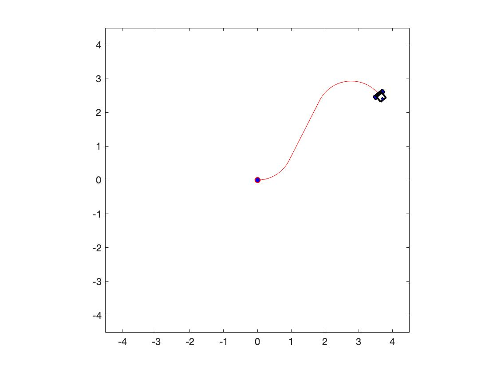
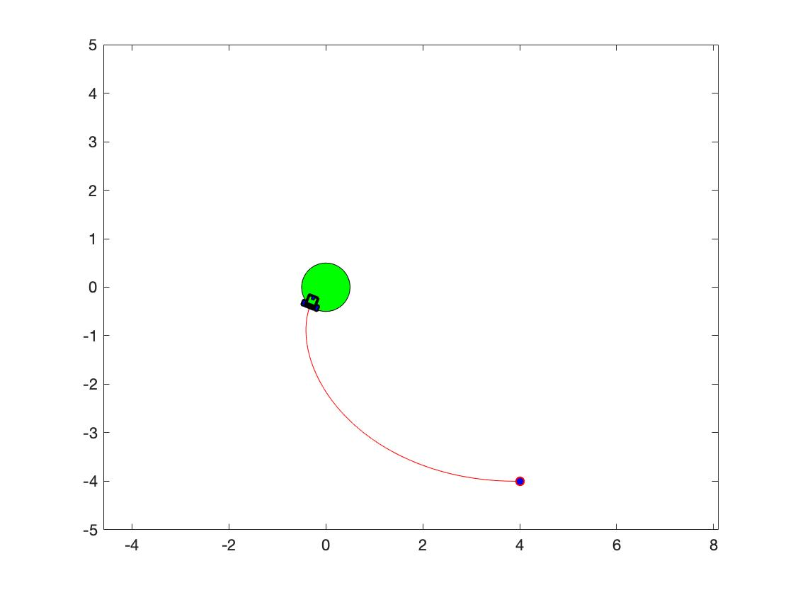
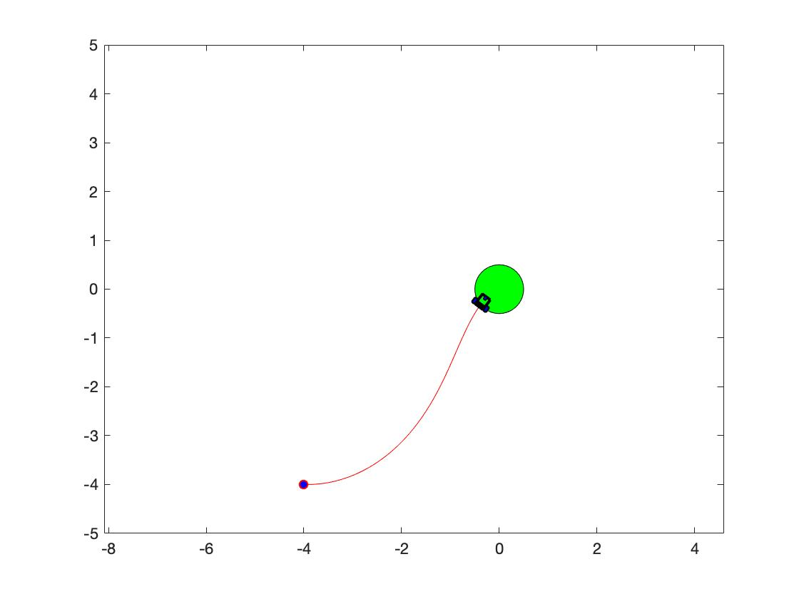

# CS401 Assignment 2

**Name**: 徐逸飞（Yifei Xu） 

**SID**: 11611209

## Notion: 

* Given position: $$\vec P$$ = (x, y) 
* The angular velocity: $$\omega$$
* GIven field scaling: *K*
* The velocity: $$\vec V $$, $$\vec V_{l}$$, $$\vec V_{r}$$
* The radius of rotation: *R*
* The distance between two wheels: *l*

## Part 1 - The Advantages and Limits of Different Wheel Drives
---

#### Differential Drive: 

- **Pros**

  - Simplicity - The differential drive system is very simple, often the drive wheel is directly connected to the motor.
- **Cons**
  - Control - It is difficult for a differential drive robot to move in a straight line. Since the drive wheels are independent, if they are not turning at exactly the same rate the robot will veer to one side. Making the drive motors turn at the same rate is a challenge due to slight differences in the motors, friction differences in the drivetrains, and friction differences in the wheel-ground interface.
  - Non-holonomic Constraints - Non-holonomic constraints reduce the control space with respect to the current configuration and move sideway is impossible.

#### Ackerman Drive:

- **Pros**
  - Its intention is to avoid the need for tires to lip sideways when following the path around a curve. While more complex, this arrangement enhances controllability by avoiding large inputs from road surface variations being applied to the end of a long lever arm, as well as greatly reducing the fore-and-aft travel of the steered wheels.
- **Cons**
  - Complexity
  - Non-holonomic Constraints - Non-holonomic constraints reduce the control space with respect to the current configuration and move sideway is impossible.

#### Synchronous Drive:

- **Pros**
  - All wheels actuated synchronously by one motor make it easier to define robot speed and controal the wheels.
- **Cons**
  - Robots with synchrodrive move on a circular trajectory and cannot move sideways.
  - Non-holonomic Constraints - Non-holonomic constraints reduce the control space with respect to the current configuration and move sideway is impossible.

#### XR4000 drive:
- **Pros**
  - It can move sideway because it has no non-holonomic constraints. It is easy to drive in a straight line.
- **Cons**
  - Difficult to implement.
#### Mecanum Drive:
- **Pros**
  - Mecanum drive is usefu because it can be drived in any direction while maintain its wheels' direction. Additionally, it is easy to program.
- **Cons**
  - Incredibly expensive.

## Part 2 - Simulate The Kinematics Of A Robot With A Differential Drive
---

### Analysis
1. $$\vec V_{l}$$: 10
   $$\vec V_{r}$$: 11
   
2. $$\vec V_{l}$$: 10
   $$\vec V_{r}$$: 10
   
3. $$\vec V_{l}$$: 10
   $$\vec V_{r}$$: 11
### Result




### Code
```matlab
function main()
clc
close all
clear all
%% =========== Set the paramters =======
mob_L=0.2; % The Mobile Robot length
mob_W=0.1; % The Mobile Robot width
T=0.01; % Sampling Time
k=2; % Sampling counter
x(k-1)=0; % initilize the state x
y(k-1)=0; % initilize the state y
theta(k-1)=0; % initilize the state theta
t=0; % intilize the time
%=====================================
%% =========== The main loop ==========
vl = 10;
vr = 11;
while(t<=0.1)
    run_circle(vr,vl);
    draw_robot();
    t=t+T;
    k=k+1;
end
vl = 10;
vr = 10;
t=0;
while(t<=0.2)
    v = (vl+vr)/2;
    x(k) = v*T*cos(theta(k-1)) + x(k-1);
    y(k) = v*T*sin(theta(k-1)) + y(k-1);
    theta(k) = theta(k-1);
    draw_robot();
    t=t+T;
    k=k+1;
end
t=0;
vl = 11;
vr = 10;
while(t<=0.2)
    run_circle(vr,vl);
    draw_robot();
    t=t+T;
    k=k+1;
end


%=====================================
%% ====== Function ===================
    function run_circle(vr,vl)
        l = mob_W;
        W=(vr-vl)/l;
        R = l/2*(vl+vr)/(vr-vl);
        ICC = [x(k-1)-R*sin(theta(k-1)),y(k-1)+R*cos(theta(k-1))];
        rotate = [cos(W*T),-sin(W*T),0; sin(W*T), cos(W*T), 0; 0, 0, 1;];
        middle = [x(k-1)-ICC(1);y(k-1)-ICC(2);theta(k-1);];
        basic = [ICC(1);ICC(2);W*T;];
        new_p = rotate*middle+basic;
        x(k) = new_p(1);
        y(k) = new_p(2);
        theta(k) = new_p(3);
    end

%=====================================
function draw_goal()
        plot(0.5*cos(0:pi/20:2*pi),0.5*sin(0:pi/20:2*pi),'-')
        axis equal
        fill(0.5*cos(0:pi/20:2*pi),0.5*sin(0:pi/20:2*pi),'g');%用红色填充
    end
%% === Draw the mobile robot & Path ====
    function draw_robot()
        xmin=-4.5; % setting the figure limits
        xmax=4.5;
        ymin=-4.5;
        ymax=4.5;
        mob_L=0.2; % The Mobile Robot length
        mob_W=0.1; % The Mobile Robot width
        Tire_W=0.05; % The Tire width
        Tire_L=mob_L/2;  % The Tire length
        plot(x,y,'-r') % Dawing the Path
        axis([xmin xmax ymin ymax]) % setting the figure limits
        axis square
        hold on
        
        plot(x(1),y(1),'ro','MarkerFaceColor','b')
        
        % Body
        v1=[mob_L;-mob_W];
        v2=[-mob_L/4;-mob_W];
        v3=[-mob_L/4;mob_W];
        v4=[mob_L;mob_W];
        %Right Tire
        v5=[Tire_L/2;-mob_W-0.02];
        v6=[Tire_L/2;-mob_W-Tire_W-0.02];
        v7=[-Tire_L/2;-mob_W-Tire_W-0.02];
        v8=[-Tire_L/2;-mob_W-0.02];
        %Left Tire
        v9=[Tire_L/2;mob_W+0.02];
        v10=[Tire_L/2;mob_W+Tire_W+0.02];
        v11=[-Tire_L/2;mob_W+Tire_W+0.02];
        v12=[-Tire_L/2;mob_W+0.02];
        %Line
        v13=[0;-mob_W-0.02];
        v14=[0;mob_W+0.02];
        %Front Tire
        v15=[mob_L;Tire_W/2];
        v16=[mob_L;-Tire_W/2];
        v17=[mob_L-Tire_L/1.5;-Tire_W/2];
        v18=[mob_L-Tire_L/1.5;Tire_W/2];
        
        R=[cos(theta(k)) -sin(theta(k));sin(theta(k)) cos(theta(k))]; % Rotation Matrix
        P=[x(k);y(k)]; % Position Matrix
        
        v1=R*v1+P;
        v2=R*v2+P;
        v3=R*v3+P;
        v4=R*v4+P;
        
        v5=R*v5+P;
        v6=R*v6+P;
        v7=R*v7+P;
        v8=R*v8+P;
        
        v9=R*v9+P;
        v10=R*v10+P;
        v11=R*v11+P;
        v12=R*v12+P;
        
        v13=R*v13+P;
        v14=R*v14+P;
        
        v15=R*v15+P;
        v16=R*v16+P;
        v17=R*v17+P;
        v18=R*v18+P;
        
        
        %Body
        mob_x=[v1(1) v2(1) v3(1) v4(1) v1(1)];
        mob_y=[v1(2) v2(2) v3(2) v4(2) v1(2)];
        plot(mob_x,mob_y,'-k','linewidth',2)
        
        %Right Tire
        mob_x=[v5(1) v6(1) v7(1) v8(1) v5(1)];
        mob_y=[v5(2) v6(2) v7(2) v8(2) v5(2)];
        plot(mob_x,mob_y,'-k','linewidth',2)
        fill(mob_x,mob_y,'b')
        
        %Left Tire
        mob_x=[v9(1) v10(1) v11(1) v12(1) v9(1)];
        mob_y=[v9(2) v10(2) v11(2) v12(2) v9(2)];
        plot(mob_x,mob_y,'-k','linewidth',2)
        fill(mob_x,mob_y,'b')
        
        %Line Between tires
        mob_x=[v13(1) v14(1)];
        mob_y=[v13(2) v14(2)];
        plot(mob_x,mob_y,'-k','linewidth',3)
        
        %Front tire
        mob_x=[v15(1) v16(1) v17(1) v18(1) v15(1)];
        mob_y=[v15(2) v16(2) v17(2) v18(2) v15(2)];
        plot(mob_x,mob_y,'-k','linewidth',1)
        fill(mob_x,mob_y,'b')
        
        drawnow
        hold off
    end
%=====================================
end
```
## Part 3 - Simulate the motion control of a robot with a differential drive and show the resulting paths w.r.t. different control laws
---
### Result



### Code
```matlab
function main()
clc
close all
clear all
%% =========== Set the paramters =======
mob_L=0.2; % The Mobile Robot length
mob_W=0.1; % The Mobile Robot width
T=0.01; % Sampling Time
k=2; % Sampling counter
x(k-1)=4; % initilize the state x
y(k-1)=2; % initilize the state y
theta(k-1)=0.5; % initilize the state theta
t=0; % intilize the time
goalx=0;
goaly=0;

k_rho = 3;
k_alpha = 8;
k_beta = -1.5;
%=====================================
%% =========== The main loop ==========
while(x(k-1)^2+y(k-1)^2>0.5^2)
    
    delta_x = goalx-x(k-1);
    delta_y = goaly-y(k-1);
    
    rho = sqrt(delta_x^2+delta_y^2);
    alpha = -theta(k-1)+atan2(delta_y,delta_x);
    disp(alpha*180/pi);

    if(-pi>=alpha||alpha>pi)
        theta(k-1) = -theta(k-1);
        disp("aaa");
        alpha = -theta(k-1)+atan2(delta_y,delta_x);
    end

    beta = -theta(k-1)-alpha;
    v = k_rho*rho;
    W = k_alpha*alpha+k_beta*beta;
    theta(k) = W*T+theta(k-1);

    
    x(k) = v*T*cos(theta(k-1)) + x(k-1);
    y(k) = v*T*sin(theta(k-1)) + y(k-1);
    
    draw_robot();
    t=t+T;
    k=k+1;
end
%=====================================
    function draw_goal()
        plot(0.5*cos(0:pi/20:2*pi),0.5*sin(0:pi/20:2*pi),'-')
        axis equal
        fill(0.5*cos(0:pi/20:2*pi),0.5*sin(0:pi/20:2*pi),'g');%用红色填充
    end

%% === Draw the mobile robot & Path ====
    function draw_robot()
        xmin=-5; % setting the figure limits
        xmax=5;
        ymin=-5;
        ymax=5;
        mob_L=0.2; % The Mobile Robot length
        mob_W=0.1; % The Mobile Robot width
        Tire_W=0.05; % The Tire width
        Tire_L=mob_L/2;  % The Tire length
        plot(x,y,'-r') % Dawing the Path
        axis([xmin xmax ymin ymax]) % setting the figure limits
        axis square
        hold on
        
        plot(x(1),y(1),'ro','MarkerFaceColor','b')
        draw_goal();
        % Body
        v1=[mob_L;-mob_W];
        v2=[-mob_L/4;-mob_W];
        v3=[-mob_L/4;mob_W];
        v4=[mob_L;mob_W];
        %Right Tire
        v5=[Tire_L/2;-mob_W-0.02];
        v6=[Tire_L/2;-mob_W-Tire_W-0.02];
        v7=[-Tire_L/2;-mob_W-Tire_W-0.02];
        v8=[-Tire_L/2;-mob_W-0.02];
        %Left Tire
        v9=[Tire_L/2;mob_W+0.02];
        v10=[Tire_L/2;mob_W+Tire_W+0.02];
        v11=[-Tire_L/2;mob_W+Tire_W+0.02];
        v12=[-Tire_L/2;mob_W+0.02];
        %Line
        v13=[0;-mob_W-0.02];
        v14=[0;mob_W+0.02];
        %Front Tire
        v15=[mob_L;Tire_W/2];
        v16=[mob_L;-Tire_W/2];
        v17=[mob_L-Tire_L/1.5;-Tire_W/2];
        v18=[mob_L-Tire_L/1.5;Tire_W/2];
        
        R=[cos(theta(k)) -sin(theta(k));sin(theta(k)) cos(theta(k))]; % Rotation Matrix
        P=[x(k);y(k)]; % Position Matrix
        
        v1=R*v1+P;
        v2=R*v2+P;
        v3=R*v3+P;
        v4=R*v4+P;
        
        v5=R*v5+P;
        v6=R*v6+P;
        v7=R*v7+P;
        v8=R*v8+P;
        
        v9=R*v9+P;
        v10=R*v10+P;
        v11=R*v11+P;
        v12=R*v12+P;
        
        v13=R*v13+P;
        v14=R*v14+P;
        
        v15=R*v15+P;
        v16=R*v16+P;
        v17=R*v17+P;
        v18=R*v18+P;
        
        
        %Body
        mob_x=[v1(1) v2(1) v3(1) v4(1) v1(1)];
        mob_y=[v1(2) v2(2) v3(2) v4(2) v1(2)];
        plot(mob_x,mob_y,'-k','linewidth',2)
        
        %Right Tire
        mob_x=[v5(1) v6(1) v7(1) v8(1) v5(1)];
        mob_y=[v5(2) v6(2) v7(2) v8(2) v5(2)];
        plot(mob_x,mob_y,'-k','linewidth',2)
        fill(mob_x,mob_y,'b')
        
        %Left Tire
        mob_x=[v9(1) v10(1) v11(1) v12(1) v9(1)];
        mob_y=[v9(2) v10(2) v11(2) v12(2) v9(2)];
        plot(mob_x,mob_y,'-k','linewidth',2)
        fill(mob_x,mob_y,'b')
        
        %Line Between tires
        mob_x=[v13(1) v14(1)];
        mob_y=[v13(2) v14(2)];
        plot(mob_x,mob_y,'-k','linewidth',3)
        
        %Front tire
        mob_x=[v15(1) v16(1) v17(1) v18(1) v15(1)];
        mob_y=[v15(2) v16(2) v17(2) v18(2) v15(2)];
        plot(mob_x,mob_y,'-k','linewidth',1)
        fill(mob_x,mob_y,'b')
        
        drawnow
        hold off
    end
%=====================================

end
```
