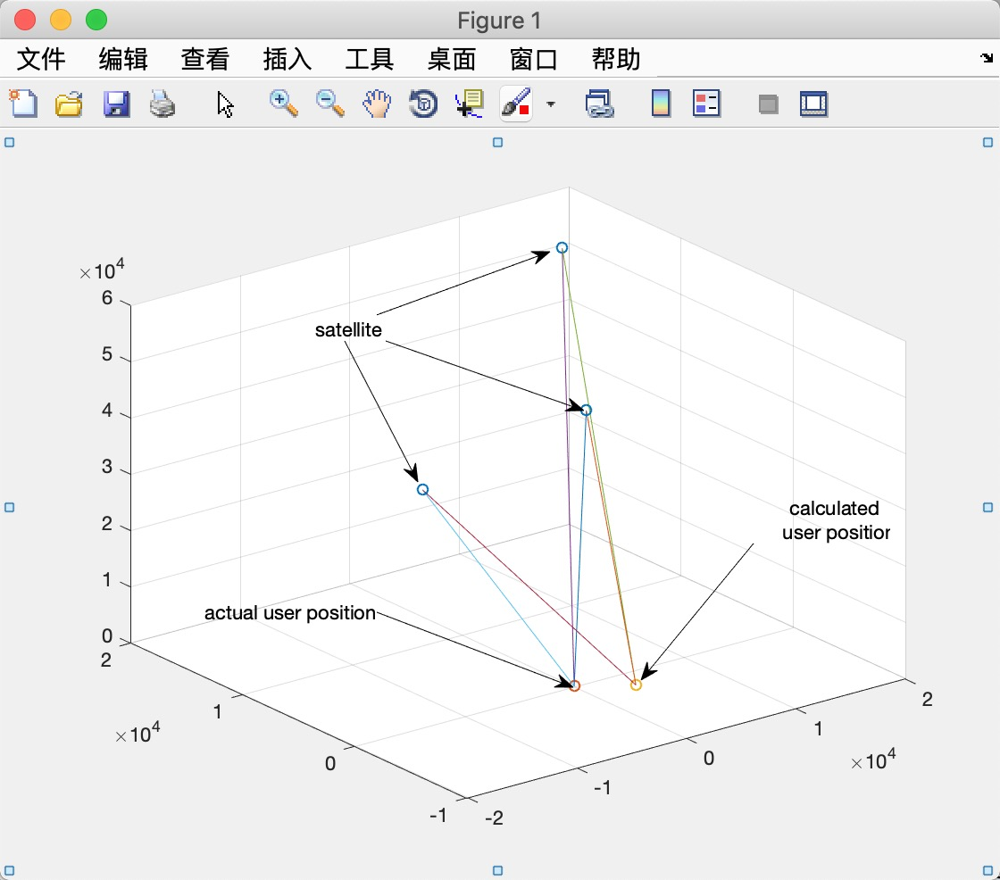
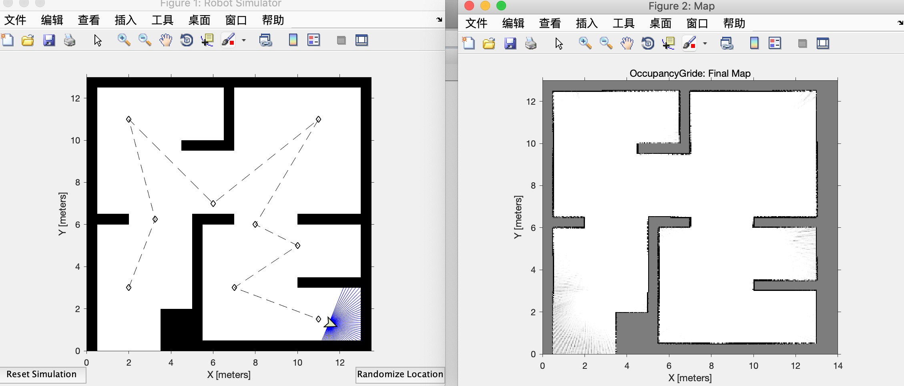

# CS401 Assignment 3

**Name**: 徐逸飞（Yifei Xu） 

**SID**: 11611209

## Problem 1 - If there are 100 lines in the grating, what is the smallest detectable change in motor-shaft angle?

​    The smallest detectable change is 360$^{\circ}{\div} 100 {\div}4=0.9^{\circ}$. Because there are 4 staes in this diagram and once it shifts 0.9 degrees, it  will detect a change of states.


## Problem 2 - Explain how to determine the rotation directions if the following encoders are used. List two concerns while choosing an encoder.

​    As for problem 2, the rotation direction is clockwise if detector A is on the left of detector B.

1. Because the tooth flank blocks detector B from the light, it corresponds to the state 1.
2. With the clockwise rotation, the tooth flank blocks both detectors A and B from the light, which corresponds to the state 2.
3. Then the tooth flank blocks both detectors A from the light and it corresponds to the state 3.

4. Finally, with the rotation, both A and B are able to dectect the light, which corresponds to state 4.


As for the concerns:

1. If the rotation is fast enough, the generated states of encoders are unconvincing and inaccurate because the required time of detection and resolution of low or high voltage is too limited.
2. It is inevitable that the 


## Problem 3: Simulate the process of localization with GPS signals. When sender-receiver clocks are either synchronized or not synchronized, how many satellites are needed to achieve 3D accurate positions, respectively?

- **synchronized**

  ​    In general, 3 statellites are needed to get solutions of a three-dimensional quadratic equation, two solutions usually. So 4 statellites are needed to achieve 3D accurate positions. 



- **asynchronized**

  ​    Like synchronized sender-receiver clocks, it should be 5 statellites to achieve 3D accurate positions because time is another unknown.


**Codes**

```matlab
close all;
clear all;


SatellitePosition=[19394,20003,49385;-20065,-6051,51085;1089,-6,48512;4056,-234,49756];
ideal_user_position = [30, 40, 50];

% the speed of light
c = 3*10^8;

% the synchronized sender's time
usr_time = 1000;

d = sqrt((SatellitePosition(:,1)-ideal_user_position(1)).^2+(SatellitePosition(:,2)-ideal_user_position(2)).^2+(SatellitePosition(:,3)-ideal_user_position(3)).^2);


syn_t = -d/c+usr_time;
disp(syn_t)


[p,fval] = fsolve(@(p) getSyn(p,SatellitePosition(:,1),SatellitePosition(:,2),SatellitePosition(:,3),syn_t,c,usr_time),ideal_user_position);

asyn_t = syn_t;

[a_p,fval] = fsolve(@(a_p) getAsyn(a_p,SatellitePosition(:,1),SatellitePosition(:,2),SatellitePosition(:,3),asyn_t,c,usr_time),[ideal_user_position,0]);

disp('the calculated synchronized user position is ');
disp(p');
disp(a_p');

disp('the ideal user position is ');
disp(ideal_user_position');

scatter3(SatellitePosition(:,1),SatellitePosition(:,2),SatellitePosition(:,3));
hold on
scatter3(ideal_user_position(:,1),ideal_user_position(:,2),ideal_user_position(:,3));
scatter3(p(1),p(2),p(3));

for i=1:length(SatellitePosition)
    plot3([SatellitePosition(i,1),ideal_user_position(1)],[SatellitePosition(i,2),ideal_user_position(2)],[SatellitePosition(i,3),ideal_user_position(3)]);
    plot3([SatellitePosition(i,1),p(1)],[SatellitePosition(i,2),p(2)],[SatellitePosition(i,3),p(3)]);

end


function f = getSyn(p,x,y,z,t,c,usr_time)
f = [sqrt((x(1)-p(1))^2+(y(1)-p(2))^2+(z(1)-p(3))^2)-c*(usr_time-t(1));
    sqrt((x(2)-p(1))^2+(y(2)-p(2))^2+(z(2)-p(3))^2)-c*(usr_time-t(2));
    sqrt((x(3)-p(1))^2+(y(3)-p(2))^2+(z(3)-p(3))^2)-c*(usr_time-t(3))];
end

function f = getAsyn(a_p,x,y,z,t,c,usr_time)
f = [sqrt((x(1)-a_p(1))^2+(y(1)-a_p(2))^2+(z(1)-a_p(3))^2)-c*(usr_time+a_p(4)-t(1));
    sqrt((x(2)-a_p(1))^2+(y(2)-a_p(2))^2+(z(2)-a_p(3))^2)-c*(usr_time+a_p(4)-t(2));
    sqrt((x(3)-a_p(1))^2+(y(3)-a_p(2))^2+(z(3)-a_p(3))^2)-c*(usr_time+a_p(4)-t(3));
    sqrt((x(4)-a_p(1))^2+(y(4)-a_p(2))^2+(z(4)-a_p(3))^2)-c*(usr_time+a_p(4)-t(4))];
end

```


## Problem 4: Simulate the process of mapping of a room by using a moving range sensor which knows its location accurately (randomly walking, or moving along a circle).

By following the tutorial, the implementation are as follows.




```matlab
close all;
clear all;

rosshutdown;
rosinit;
sim = ExampleHelperRobotSimulator('simpleMap');
setRobotPose(sim,[2 3 -pi/2]);

enableROSInterface(sim,true);

sim.LaserSensor.NumReadings = 50;

scanSub=rossubscriber('scan');
[velPub,velMsg] = rospublisher('/mobile_base/commands/velocity');

tftree = rostf;
pause(1);

path = [2,3;3.25 6.25;2 11;6 7;11 11;8 6;10 5;7 3;11 1.5];
plot(path(:,1),path(:,2),'k--d');

controller = robotics.PurePursuit('Waypoints',path);
controller.DesiredLinearVelocity=0.4;

controlRate=robotics.Rate(10);

goalRadius = 0.1;
robotCurrentLocation=path(1,:);
robotGoal=path(end,:);
distanceToGoal = norm(robotCurrentLocation-robotGoal);

map = robotics.OccupancyGrid(14,13,20);

figureHandle=figure('Name','Map');
axesHandle = axes('Parent',figureHandle);
mapHandle = show(map,'Parent',axesHandle);
title(axesHandle,'OccupancyGrid:Update 0');

updateCounter = 1;

while(distanceToGoal > goalRadius)
    
    scanMsg = receive(scanSub);
    
    pose = getTransform(tftree,'map','robot_base',scanMsg.Header.Stamp,'Timeout',2);
    
    position = [pose.Transform.Translation.X,pose.Transform.Translation.Y];
    orientation = quat2eul([pose.Transform.Rotation.W, pose.Transform.Rotation.X, ...
        pose.Transform.Rotation.Y,pose.Transform.Rotation.Z],'ZYX');
    
    robotPose = [position,orientation(1)];
    
    scan = lidarScan(scanMsg);
    ranges = scan.Ranges;
    ranges(isnan(ranges)) = sim.LaserSensor.MaxRange;
    modScan = lidarScan(ranges,scan.Angles);
    
    insertRay(map,robotPose,modScan,sim.LaserSensor.MaxRange);
    
    [v, w] = controller(robotPose);
    velMsg.Linear.X=v;
    velMsg.Angular.Z=w;
    send(velPub,velMsg);
    
    if ~mod(updateCounter,50)
        mapHandle.CData = occupancyMatrix(map);
        title(axesHandle,['OccupancyGrid: Update' num2str(updateCounter)]);
    end
    
    updateCounter = updateCounter+1;
    distanceToGoal = norm(robotPose(1:2)-robotGoal);
    
    waitfor(controlRate);
    
end

show(map,'Parent',axesHandle);
title(axesHandle,'OccupancyGride: Final Map');


function myInsertRay(obj, varargin)
gridSize = obj.GridSize;
res = obj.Resolution;
loc = obj.GridLocationInWorld;

[startPt, endPt, inverseModelLogodds, rangeIsMax] = obj.parseInsertRayInputs(varargin{:});

for i = 1:size(endPt, 1)
    [endPts, middlePts] = robotics.algs.internal.raycastCells(startPt, endPt(i,:), ...
        gridSize(1), gridSize(2), res, loc);
    
    if ~isempty(middlePts)
        mIndex = sub2ind(gridSize, middlePts(:,1), middlePts(:,2));
        updateValuesMiss = obj.Logodds(mIndex) + inverseModelLogodds(1);
        updateValuesMiss(updateValuesMiss < obj.ProbSatIntLogodds(1)) = obj.ProbSatIntLogodds(1);
        obj.Logodds(mIndex) = updateValuesMiss;
    end
    
    if ~isempty(rangeIsMax) && rangeIsMax(i)
        continue;
    end
    if ~isempty(endPts)
        eIndex = sub2ind(gridSize, endPts(:,1), endPts(:,2));
        updateValuesHit = obj.Logodds(eIndex) + inverseModelLogodds(2);
        updateValuesHit(updateValuesHit > obj.ProbSatIntLogodds(2)) = obj.ProbSatIntLogodds(2);
        obj.Logodds(eIndex) = updateValuesHit;
    end
end
end

```

