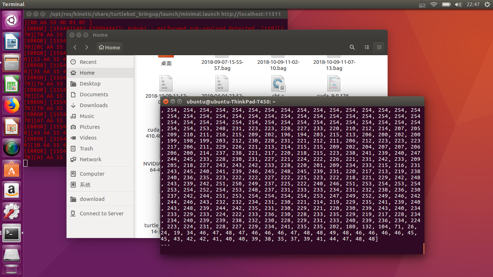
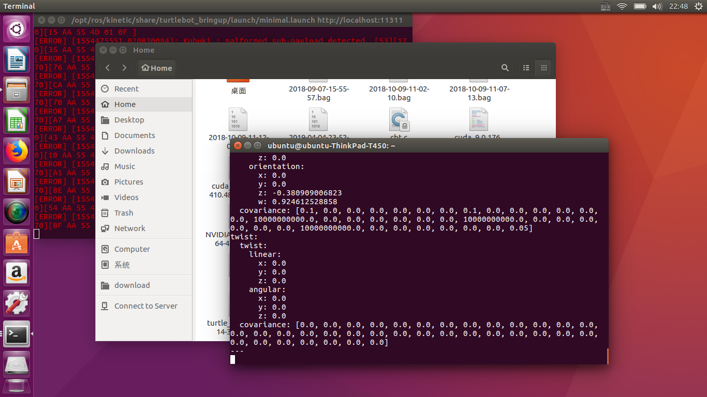
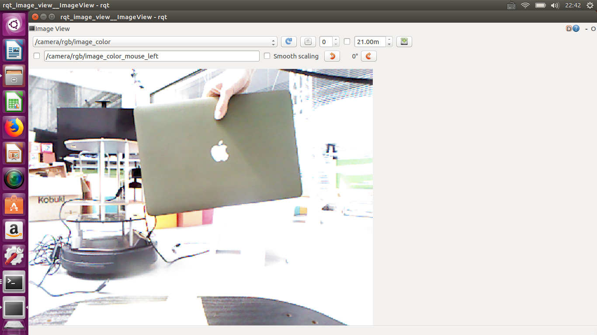
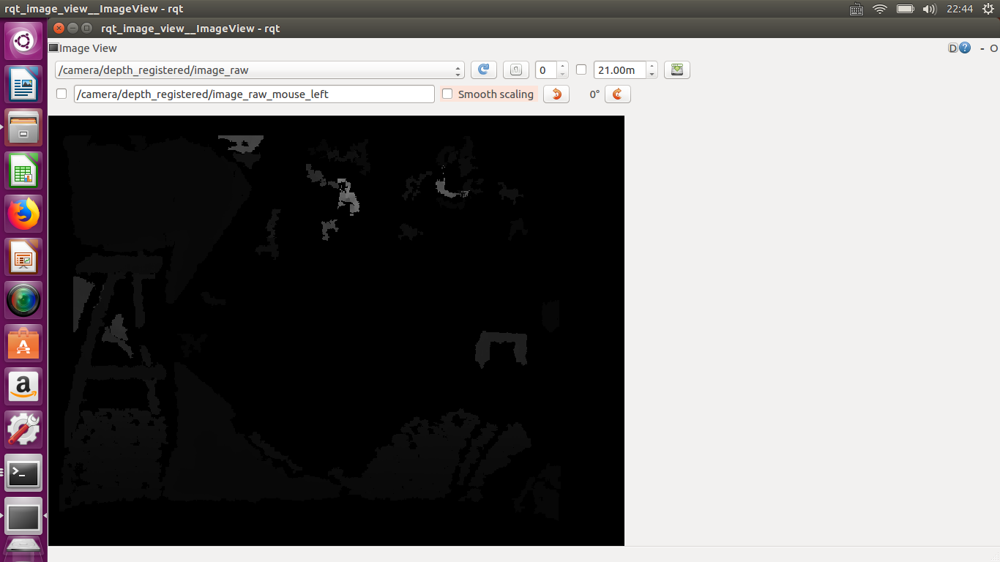
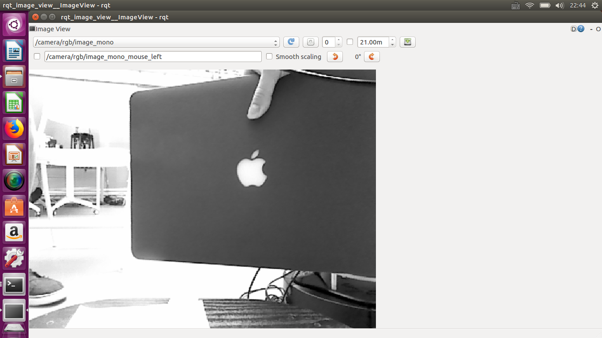

# CS401 Project 2

**Name**: 徐逸飞（Yifei Xu), 伍凯铭(Kaiming Wu)

**SID**: 11611209, 11611326

### Message

**/camera/rgb/image_color**

The message of image_color.

**/camera/depth_registered/image_raw**

The message of image_raw. The reason why they are all zeros is that we set the robot in an open area.

**/camera/rgb/image_mono**

The message of image_color.

**/odom**

Odom let users get the velocity of the turtlebot at a desired time.

**/tf**

tf is a package that lets the user keep track of multiple coordinate frames over time. It maintains the relationship between coordinate frames in a tree structure buffered in time. Users are able to transform points, vectors, etc between any two coordinate frames at any desired point in time.

**/tf_static**

Tf_static stores the last movement of a given time duration.

### Camera Image

**/camera/rgb/image_color**

The normal rgb data from Kinect.

**/camera/depth_registered/image_raw**

The raw data from Kinect.

**/camera/rgb/image_mono**

Monochrome image is generated and only one kind of colors are accepted.