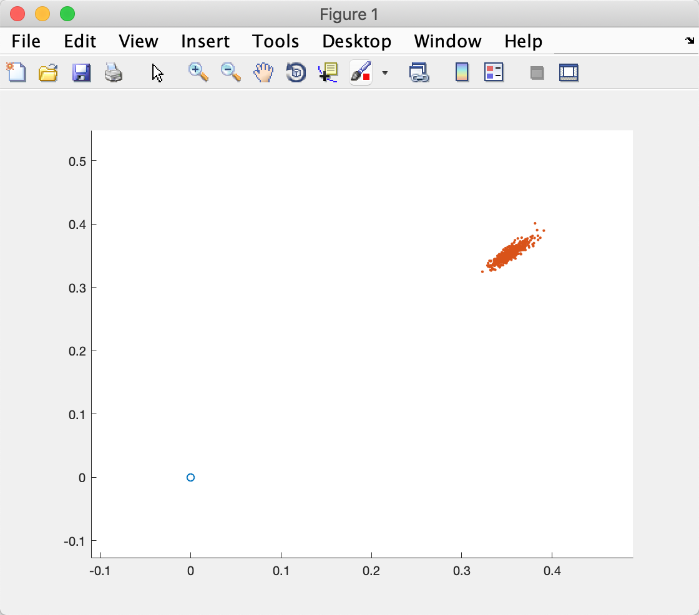

# CS401 Assignment 5

**Name**: 徐逸飞（Yifei Xu)

**SID**: 11611209


### 1. Please generate samples of the normal, triangular, and abs(x) distributions (N=10^6) .

**Analysis**

The normal distribution can be regarded as a blend of several uniform distributions.

The triangle distribution can be regarded as a blend of two uniform distributions. By normalization, multiplied by $\frac{\sqrt6}{2}​$, the representation looks like a triangle.

Using following algorithm is able to represente the distribution of every given function. e.g. abs(x)


**Algorithm**

- mathmatic function

**p(accept)** = $\int \frac{f(x)}{2bf_{max}U(x)}U(x)dx$ = $\frac{1}{2bf_{max}}\int f(x)dx$


- pseudocode

```pseudocode
sample_distribution(f,b):
repeat
	x = rand(-b,b)
	y = rand(0,max{f(x)| x∈(-b,b)})
until (y ≤ f(x))
return x
```

 

**Result**


**Code**

normal

```matlab
clear all;
close all;

X = zeros(1,1000000);

for i = 1:1000000
    X(i) = sample_normal_distribution(10);
end

histogram(X,'Normalization','probability');

function result = sample_normal_distribution(b)
result = sum(rand(1,12)*2*b-b)/12;
end
```


triangle

```matlab
clear all;
close all;

X = zeros(1,1000000);

for i = 1:1000000
    X(i) = sample_triangular_distribution(4);
end

histogram(X,'Normalization','probability');

function result = sample_triangular_distribution(b)
result = 2*b*(rand()+rand())-2*b;
result = result * sqrt(6)/2;
end
```


abs(x)

```matlab
clear all;
close all;

num = 1000000;
X = zeros(1,num);

f = @func;
b = 1;

fmax = max(f(-b:b));

for i = 1:num
    X(i) = sample_distribution(f,fmax,b);
end

histogram(X,'Normalization','probability');

function y = func(x)
if((x>=-1) & (x<=1))
    y = abs(x);
else
    y = 0;
end
end

function result = sample_distribution(f,fmax,b)
x = rand()*2*b-b;
y = rand()*fmax;

while y >= f(x)
    x = rand()*2*b-b;
    y = rand()*fmax;
end
result = x;
end
```


### 2. Please generate samples of the odometry-based motion model (N=500).

**Analysis**

The noise of result will accumulate in every iteration. So the possible position will become more and more diverse and scatter in a wider range.

**pseudocode**

​	sample_motion_model(u, X):
​		u = <$\delta_{rot1}, \delta_{rot2},\delta_{trans}$>, X = <x,y,$\theta​$>

​		$\hat{\delta}_{rot1}$ = $\delta_{rot1}$ + normrnd($\alpha_1|\delta_{rot1}|+\alpha_2\delta_{trans}$)

​		$\hat{\delta}_{trans}$ = $\delta_{trans}$ + normrnd($\alpha_3|\delta_{trans}|+\alpha_4(|\delta_{rot1}|+|\delta_{rot2}|)$)

​		$\hat{\delta}_{rot2}$ = $\delta_{rot2}$ + normrnd($\alpha_1|\delta_{rot2}|+\alpha_2\delta_{trans}$)

​	

​		x' = x + $\hat{\delta}_{trans}cos(\theta+\hat{\delta}_{rot1})$

​		y' = y + $\hat{\delta}_{trans}sin(\theta+\hat{\delta}_{rot1})$

​		$\theta'$ = $\theta$ + $\hat{\delta}_{rot1}$ + $\hat{\delta}_{rot2}$

​		return <x', y', $\theta'$>


**Result**


**Code**

```matlab
%Algolrithm motion_model_odometry with Normal Distribution Noise
clc
close all
%Initial setting of mobile robot
x =100;
y =100;
theta = pi/4;

a1 = 0.000005;
a2 = 0.000005;
a3 = 0.000005;
a4 = 0.000005;

trajectory_data = zeros(3,500,30);
odom = zeros(3,30);
odom(:,:) = NaN;
odom(:,1:3)= 0;

trajectory_data(:,:,:) = NaN;
trajectory_data(:,:,1) = 0;

n = 1;
t = 2;

while (t <= 30 )
    
    
    if t < 10
        delta_rot1 = 0;
        
        delta_trans =50;
        
        delta_rot2 = 0;
        
        
    elseif (t >= 10)&&(t < 12)
        delta_rot1 = 0;
        
        delta_trans = 50;
        
        delta_rot2 = pi/4;
        
        
        
        
    elseif (t >= 12)&&(t < 20)
        delta_rot1 = 0;
        
        delta_trans = 50;
        
        delta_rot2 = 0;
        
        
        
        
    elseif (t >= 20)&&(t < 22)
        delta_rot1 = 0;
        
        delta_trans = 50;
        
        delta_rot2 = pi/4;
        
        
    elseif (t >= 22)&&(t <= 30)
        delta_rot1 = 0;
        
        delta_trans = 50;
        
        delta_rot2 = 0;
        
        
    end
    
    
    for n = 1: 500
        
        X = sample_motion_model([delta_rot1,delta_rot2,delta_trans],trajectory_data(:,n,t-1),theta,a1,a2,a3,a4);
        
        trajectory_data(1,n,t) = X(1);
        
        trajectory_data(2,n,t) = X(2);
        
        trajectory_data(3,n,t) = X(3);
        
        theta = X(3);
        
    end
    
    
    
    t = t + 1;
    
    
    if t < 10
        
        delta_rot1 = 0;
        
        delta_trans =50;
        
        delta_rot2 = 0;
        
        odom(1,t) = odom(1,t-1) + delta_trans;
        
        odom(2,t) = odom(2,t-1);
        
        odom(3,t) = odom(3,t-1) + delta_rot1 + delta_rot2;
        
    elseif (t >= 10)&&(t < 12)
        delta_rot1 = 0;
        
        delta_trans = 50;
        
        delta_rot2 = deg2rad(45);
        
        odom(1,t) = odom(1,t-1) + delta_trans * cos(theta + delta_rot1);
        
        odom(2,t) = odom(2,t-1) + delta_trans * sin(theta + delta_rot1);
        
        odom(3,t) = odom(3,t-1) + delta_rot1 + delta_rot2;
        
        
    elseif (t >= 12)&&(t < 20)
        delta_rot1 = 0;
        
        delta_trans = 50;
        
        delta_rot2 = 0;
        
        odom(1,t) = odom(1,t-1);
        
        odom(2,t) = odom(2,t-1) + delta_trans;
        
        odom(3,t) = odom(3,t-1) + delta_rot1 + delta_rot2;
        
        
    elseif (t >= 20)&&(t < 22)
        delta_rot1 = 0;
        
        delta_trans = 50;
        
        delta_rot2 = deg2rad(45);
        
        odom(1,t) = odom(1,t-1) + delta_trans * cos(theta + delta_rot1);
        
        odom(2,t) = odom(2,t-1) + delta_trans * sin(theta + delta_rot1);
        
        odom(3,t) = odom(3,t-1) + delta_rot1 + delta_rot2;
        
        
    elseif (t >= 22)&&(t <= 31)
        delta_rot1 = 0;
        
        delta_trans = 50;
        
        delta_rot2 = 0;
        
        odom(1,t) = odom(1,t-1) + delta_trans * cos(-pi);
        
        odom(2,t) = odom(2,t-1);
        
        odom(3,t) = odom(3,t-1) + delta_rot1 + delta_rot2;
    end
end

plot(odom(1,:),odom(2,:),'r','LineWidth',1.5);
hold on

for m = 1:30
    scatter(trajectory_data(1,5:500,m),trajectory_data(2,5:500,m),'.');
    hold on
end

function result = sample_motion_model(u,X,theta,a1,a2,a3,a4)
delta_rot1_noise = u(1) - normrnd(0,(a1*u(1)^2 + a2*u(3)^2));
delta_trans_noise = u(3) - normrnd(0,(a3*u(3)^2 + a4*u(1)^2 + a4*u(2)^2));
delta_rot2_noise = u(2) - normrnd(0,(a1*u(2)^2 + a2*u(3)^2));

x = X(1) + delta_trans_noise * cos(theta + delta_rot1_noise);
y = X(2) + delta_trans_noise * sin(theta + delta_rot1_noise);
theta = X(3) + delta_rot1_noise + delta_rot2_noise;
result = [x,y,theta];
end
```


### 3. Please generate samples of the velocity-based motion model
for following cases (N=500).

**Analysis**

The meanings of $\alpha$ are as follows.

$\alpha_1$, $\alpha_2​$ : affect position due to velocity.

$\alpha_3$, $\alpha_4$ : affect position due to angular velocity.

$\alpha_5$, $\alpha_6​$ : affect the turning radius.

**Result**

- Task1

  

- Task2

  

- Task3

  

**Code**

```matlab
clc
close all

u = [1 0];
%task 1
%a = [0.02 0.02 0.2 0.2 0.005 0.005];

%task 2
% a = [0.03 0.03 0.03 0.03 0.005 0.005];

%task 3
a = [0.005 0.005 0.5 0.5 0.005 0.005];

X0 = [0 0 pi/4];
X = zeros(3,500);

d_t = 0.5;
for i=1:500
    X(:,i) = sample_motion_model_velocity(u,X0,a,d_t);
end
hold on
scatter(X0(1),X0(2));
scatter(X(1,:),X(2,:),'.');
hold off
function result = sample_motion_model_velocity(u,X,a,d_t)
v = u(1)+normrnd(0,(a(1)*u(1)^2+a(2)*u(2)^2));
w = u(2)+normrnd(0,(a(3)*u(1)^2+a(4)*u(2)^2));
gamma = normrnd(0,(a(5)*u(1)^2+a(6)*u(2)^2));

x = X(1)-v/w*sin(X(3))+v/w*sin(X(3)+w*d_t);
y = X(2)+v/w*cos(X(3))-v/w*cos(X(3)+w*d_t);
theta = X(3)+w*d_t+gamma*d_t;
result = [x,y,theta];
end
```


### 4. Please generate the map-consistent probability model in thefollowing situation.

**Result**


**Code**

```matlab
clc
close all

u = [1 0];
%task 1
% a = [0.02 0.02 0.2 0.2 0.005 0.005];

%task 2
% a = [0.03 0.03 0.03 0.03 0.005 0.005];

%task 3
a = [0.005 0.005 0.5 0.5 0.005 0.005];

rect = [0.25 0.35 0.15 0.05];

X0 = [0 0 pi/4];
X = zeros(3,500);

d_t = 0.5;
for i=1:500
    X(:,i) = sample_motion_model_velocity(u,X0,a,d_t);
end
X = filter(X,rect(1),rect(2),rect(1)+rect(3),rect(2)+rect(4));

hold on
scatter(X0(1),X0(2));
scatter(X(1,:),X(2,:),'.');
rectangle('Position',rect);
hold off

function result = sample_motion_model_velocity(u,X,a,d_t)
v = u(1)+normrnd(0,(a(1)*u(1)^2+a(2)*u(2)^2));
w = u(2)+normrnd(0,(a(3)*u(1)^2+a(4)*u(2)^2));
gamma = normrnd(0,(a(5)*u(1)^2+a(6)*u(2)^2));

x = X(1)-v/w*sin(X(3))+v/w*sin(X(3)+w*d_t);
y = X(2)+v/w*cos(X(3))-v/w*cos(X(3)+w*d_t);
theta = X(3)+w*d_t+gamma*d_t;
result = [x,y,theta];
end

function result = filter(X,x1,y1,x2,y2)
    [n,m] = size(X);
    for i= 1:m
        if(X(1,i)<=x2&X(1,i)>=x1&X(2,i)>=y1&X(2,i)<=y2)
            X(:,i) = [nan,nan,nan];
        end 

    end
    result = X;
end
```