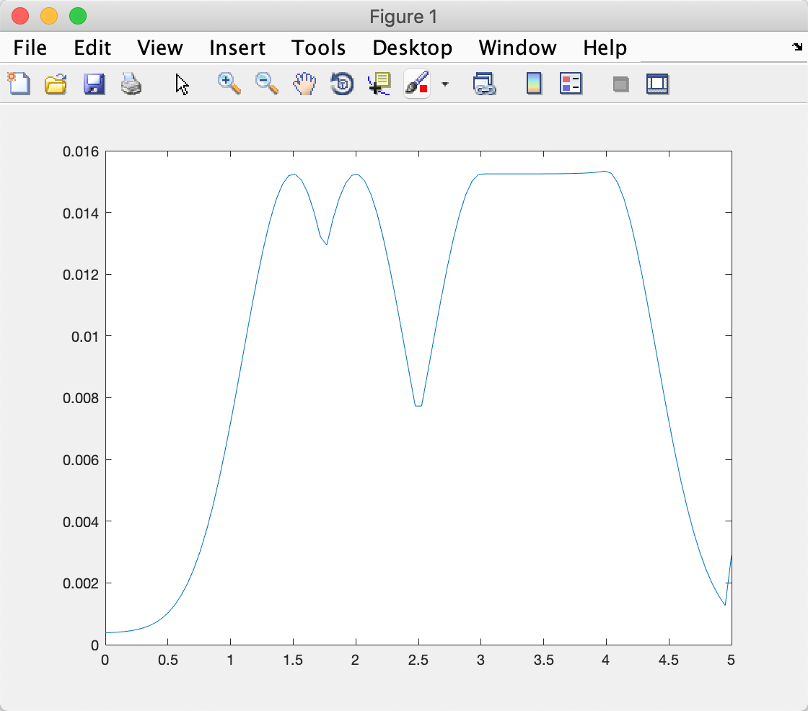

# CS401 Assignment 6

**Name**: 徐逸飞（Yifei Xu)

**SID**: 11611209


#### Please build the beam-based measurement model with a mixture of four distributions (by choosing five different sets of parameters) and generate 104 samples with the maximum distance of 500cm.

**Analysis**

Alpha is the contribution of each distribution. By modifying alpha, we can change the maximum value of pdf.

**Result**

1. $\alpha​$ = [0.25 0.25 0.25 0.25]


2. $\alpha​$ = [0.85 0.1 0.05 0.05]

   

3. $\alpha​$ = [0.15 0.15 0.35 0.35]

      

4. $\alpha$ = [0.35 0.35 0.15 0.15]

      

5. $\alpha$ = [0.1 0.05 0.05 0.8]

      

      

**Code**

```matlab
clear all;
close all;

K = 10000;


z_MAX = 5;

zt = linspace(0,z_MAX,K);

p = ones(1,K);

obstacle = 3;

for i = 1:K
    z_tk = zt(i);
    z_tk_star = obstacle;
    p(i) = beam_range_finder_model(z_tk,z_tk_star,z_MAX);

end

plot(zt,p/sum(p(:)));

function q = beam_range_finder_model(z_tk,z_tk_star,z_MAX)
sigma_hit= 0.4;
lambda_short=0.5;

% four types alpha
z_hit= 0.25;
z_short= 0.25;
z_max=0.25;
z_rand=0.25;

q = 1;
p =z_hit*p_hit(z_tk,z_tk_star,sigma_hit,z_MAX)+ ...
    z_short*p_short(z_tk,z_tk_star,lambda_short)+...
    z_rand*p_max(z_tk,z_MAX)+...
    z_max*p_rand(z_tk,z_MAX);

q = q*p;

end


function p = p_hit(z_tk,z_tk_star,sigma_hit,z_MAX)
if(z_tk<=z_MAX&&z_tk>=0)
    eta = normcdf([0 z_MAX],z_tk_star,sigma_hit);
    eta = 1/(eta(2)-eta(1));
    p = eta*normpdf(z_tk,z_tk_star,sigma_hit);
else
    p = 0;
end
end

function p = p_short(z_tk,z_tk_star,lambda_short)
if(0<=z_tk&&z_tk<=z_tk_star)
    eta = 1/(1-exp(-lambda_short*z_tk_star));
    p = eta*exppdf(z_tk,1/lambda_short);
else
    p = 0;
end
end

function p = p_max(z_tk,z_MAX)
if(z_tk==z_MAX)
    p = 1;
else
    p = 0;
end
end

function p = p_rand(z_tk,z_MAX)
if(0<=z_tk&&z_tk<=z_MAX)
    p = 1/z_MAX;
else
    p = 0;
end
end

function result = sample_distribution(f,fmax,z_tk_star,sigma_hit,z_MAX)
z_tk = rand()*z_MAX;
p = rand()*fmax;

while p >= f(z_tk,z_tk_star,sigma_hit,z_MAX)
    z_tk = rand()*z_MAX;
    p = rand()*fmax;
end
result = z_tk;
end
```


#### Given the following environment and the robot pose, please generate the scan measurement likelihood field and the beam measurement probability model.


**Analysis**

The smooth part of pdf is the biggest rectangular obstacle in the above graph. And two peaks are the point obstacles.

**Result**



**Code**

```matlab
clear all;
close all;

K = 100;
obstacle = cat(2,[1.5,2],linspace(3,4,1000));
z_MAX = 5;
zt = linspace(0,z_MAX,K);
[n,m] = size(obstacle);
final_p = zeros(1,K);
for i = 1:m
p = get_p(zt,z_MAX,obstacle(i),K);
final_p=final_p.*(final_p>=p)+p.*(final_p<p);
end
plot(zt,final_p/sum(final_p(:)));


function p = get_p(zt,z_MAX,obstacle,K)
p = ones(1,K);
for i = 1:K
    z_tk = zt(i);
    z_tk_star = obstacle;
    p(i) = beam_range_finder_model(z_tk,z_tk_star,z_MAX);
end
end

function q = beam_range_finder_model(z_tk,z_tk_star,z_MAX)
sigma_hit= 0.4;

z_hit= 0.8;
z_max=0.1;
z_rand=0.1;

q = 1;
p =z_hit*p_hit(z_tk,z_tk_star,sigma_hit,z_MAX)+ ...
    z_rand*p_max(z_tk,z_MAX)+...
    z_max*p_rand(z_tk,z_MAX);

q = q*p;
end


function p = p_hit(z_tk,z_tk_star,sigma_hit,z_MAX)
if(z_tk<=z_MAX&&z_tk>=0)
    eta = normcdf([0 z_MAX],z_tk_star,sigma_hit);
    eta = 1/(eta(2)-eta(1));
    p = eta*normpdf(z_tk,z_tk_star,sigma_hit);
else
    p = 0;
end
end


function p = p_max(z_tk,z_MAX)
if(z_tk==z_MAX)
    p = 1;
else
    p = 0;
end
end

function p = p_rand(z_tk,z_MAX)
if(0<=z_tk&&z_tk<=z_MAX)
    p = 1/z_MAX;
else
    p = 0;
end
end
```


#### Please generate the following landmark measurement probability model by using 3 ranging sensors.

**Analysis**

Combined with noise following normal distribution, the accurate position in red is surronded with possible postion in blue.

**Result**


**Code**

```matlab
clc
close all
clear all

num = 1000;
map = [0 0;5 0;5 10];
x0 = 9;
y0 = 5;

[n,m] = size(map);
d_star = (map(:,1)-x0).^2+(map(:,2)-y0).^2;
p = zeros(num,2);
for i = 1:num
d = d_star+randn(3)-0.5;
[X,fval] = fsolve(@(X) get_p(X,map,d),[0,0]);
p(i,1) = X(1);
p(i,2) = X(2);
end

hold on
scatter(map(:,1),map(:,2));
scatter(p(:,1),p(:,2),'.','b');
scatter(x0,y0,'red');


function f = get_p(p,map,d)
f = [(map(1,1)-p(1))^2+(map(1,2)-p(2))^2-d(1);
    (map(2,1)-p(1))^2+(map(2,2)-p(2))^2-d(2);
    (map(3,1)-p(1))^2+(map(3,2)-p(2))^2-d(3)];
end
```