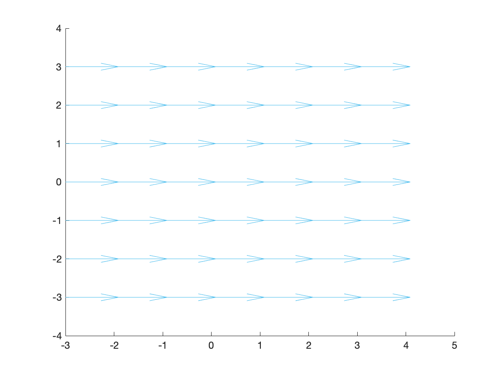
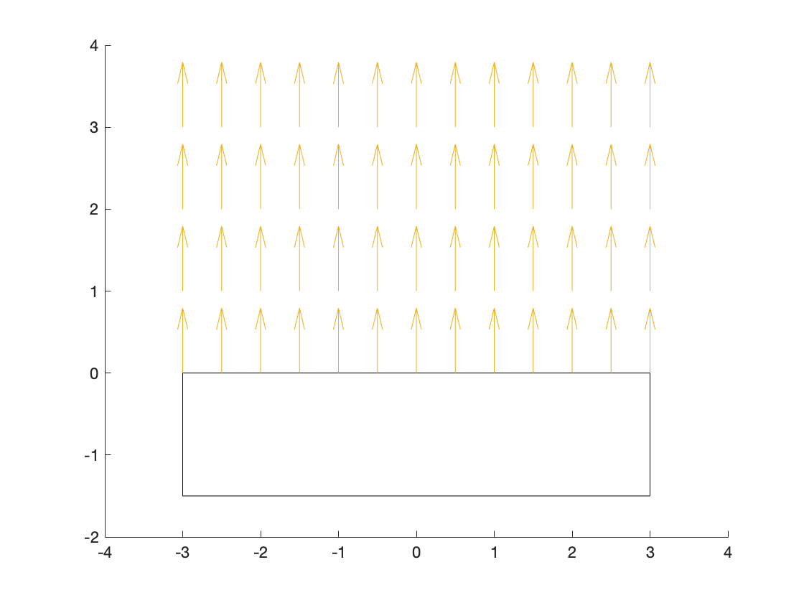
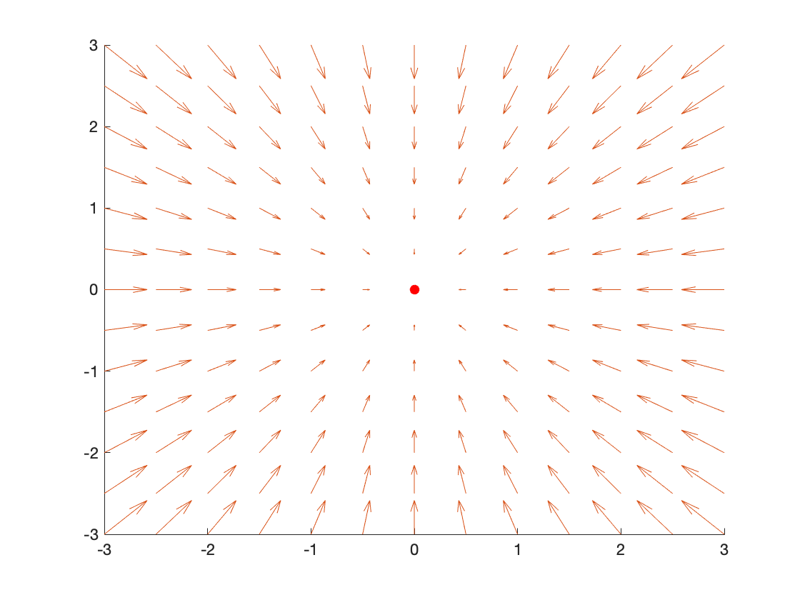
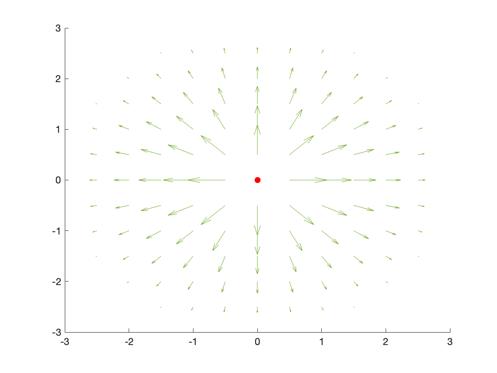
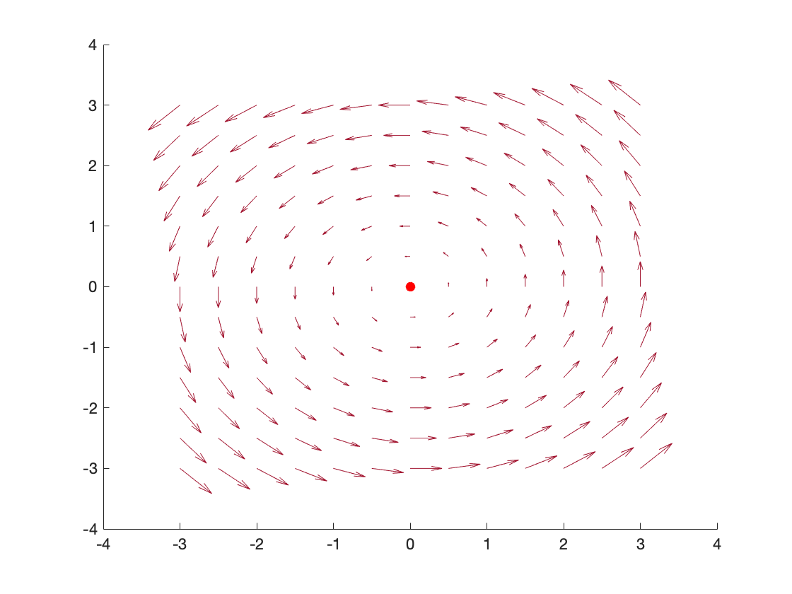
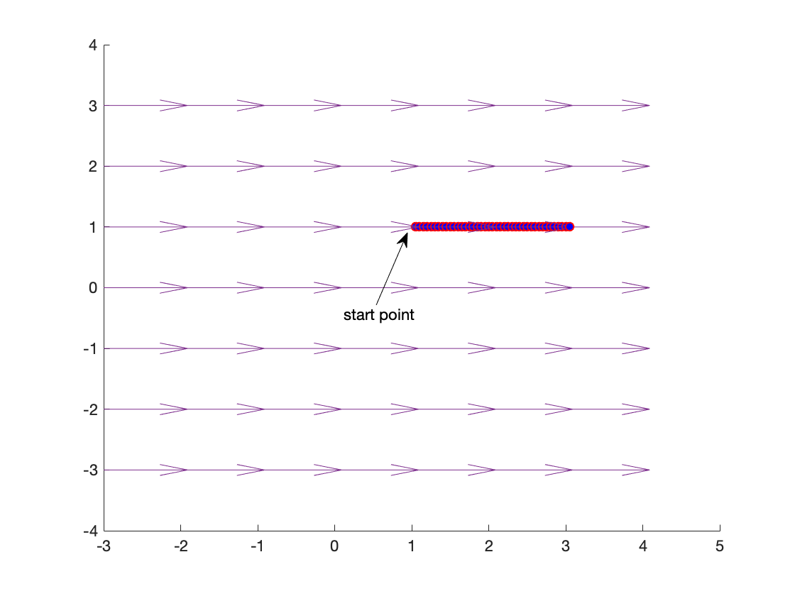
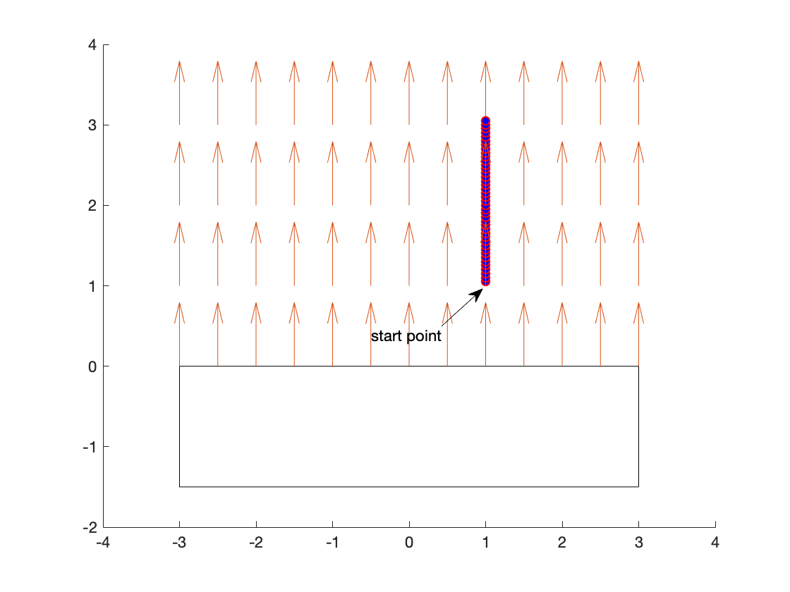
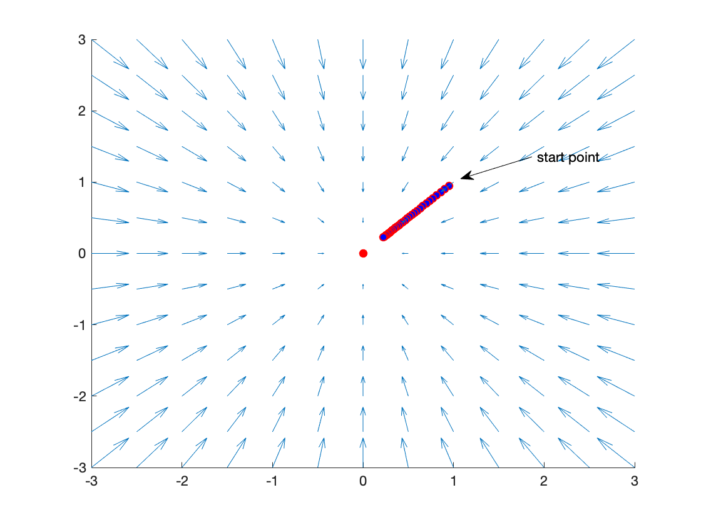
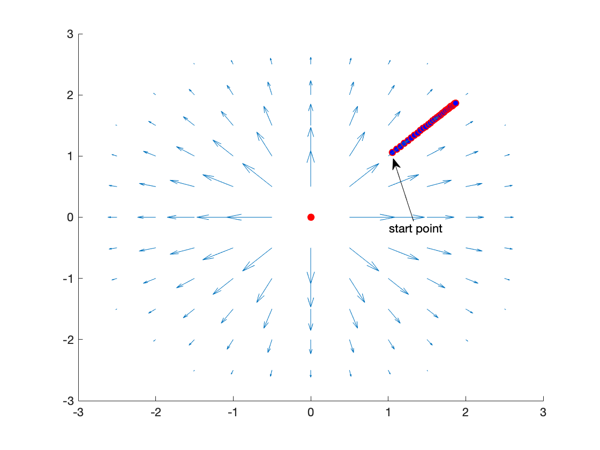
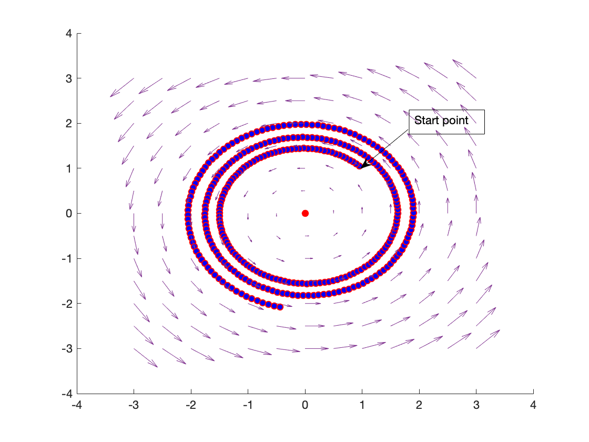

# CS401 Assignment 1

**Name**: 徐逸飞（Yifei Xu） 

**SID**: 11611209

## Notion: ##

* Given position: $$\vec P​$$ = (x, y) 
* GIven field scaling: *K*
* The velocity: $$\vec V​$$
* The maximum distance of influence: *R*
* The minimum distance of influence: *r*

## Part 1 - Analysis

**How to generate uniform, perpendicular, attractive, repulse,
tangential forces for a robot and obstacles with known
positions?**

1. **Uniform** 

> $$\vec V = V_{0}​$$

2. **Perpendicular**

>$$\vec V =\vec B_{0} , where\ \vec B_{0} * \vec P = 0 $$

3. **Attractive**

> $$\vec V =\left\{\begin{matrix}
>  0& & \vec P < \vec r\\ 
> -K  * \vec P&  & \vec r \leqslant \vec P \leqslant \vec R\\
> 0& & \vec P > \vec R
> \end{matrix}\right.​$$

4. **Repulse**

> $$\vec V =\left\{\begin{matrix}
>  0& & \vec P < \vec r\\ 
> K  * (\vec R - \vec P)&  & \vec r \leqslant \vec P \leqslant \vec R\\
> 0& & \vec P > \vec R
> \end{matrix}\right.​$$

5. **Tangential**

> $$\vec V = \vec \omega \times \vec P​$$

## Part 2 - Draw the Field

1. ### Uniform
  
---
2. ### Perparticular
  
---
3. ### Attractive
  
---
4. ### Repulse
  
---
5. ### Tangential
  
---


## Part 3 - Put the Robot In It!

1. ### Uniform
  
---
2. ### Perparticular
  
---
3. ### Attractive
  
---
4. ### Repulse
  
---
5. ### Tangential
  
---

## Part 4 - The CODE

```matlab
function test()
clc
close all
clear all
%% =========== Set the paramters =======
R = 3;
r = 0.5;


T=0.01; % Sampling Time
k=2; % Sampling counter
X(k-1)=1; % initilize the state x
Y(k-1)=1; % initilize the state y

tfinal=100; % final simulation time
t=0; % intilize the time
%=====================================
%% =========== Main function =======
while(t<=tfinal)
    t=t+T; % increase the time
    V=5;
    
    % you can change the function here to test different fields.
    result = perparticular(X(k-1),Y(k-1));
    
    X(k)=V*result(1)*T+X(k-1); % calculating x
    Y(k)=V*result(2)*T+Y(k-1); % calculating y
    
    % you can change the function here to draw different fields.
    draw_perparticular(X(k),Y(k));
    k=k+1; % increase the sampling counter
end
%=====================================
%% =========== Function defination =======

    function result = attractive(x,y)
        if(x<=R && x>=-R&&y<=R&&y>=-R)
            result = [-x,-y];
        else
            result = [0,0];
        end
    end

    function result = uniform(x,y)
        if(x<=R && x>=-R&&y<=R&&y>=-R)
            result = [1,0];
        else
            result = [0,0];
        end
    end

    function result = perparticular(x,y)
        if(x<=R && x>=-R&&y>=0&&y<=R)
            result = [0,1];
        else
            result = [0,0];
        end
    end

    function result = repulse(x,y)
        if(x^2+y^2<r^2)
            result = [sign(x)*Inf,sign(y)*Inf];
        elseif(x^2+y^2>R^2)
            result = [0,0];
        elseif(x==0)
            result = [0,sign(y)*(R-abs(y))];
        else
            slop = y/x;
            x2 = R/sqrt(slop^2+1)*sign(x);
            y2 = abs(slop)*R/sqrt(slop^2+1)*sign(y);
            result = [x2-x,y2-y];
        end
    end

    function result = tangential(x,y)
        if(x<=R && x>=-R&&y<=R&&y>=-R)
            l = sqrt(y^2+x^2);
            sita = atan(abs(y)/abs(x));
            if(x>=0&&y<0)
                sita = 2*pi - sita;
            elseif(x<=0&&y<0)
                sita = pi + sita;
            elseif(x<=0&&y>=0)
                sita = pi - sita;
            end
            sita = sita +pi/4;
            x2 = sqrt(2)*l*cos(sita);
            y2 = sqrt(2)*l*sin(sita);
            result = [x2-x,y2-y];
        else
            result = [0,0];
        end
    end

    function draw_attractive(a,b)
        hold on
        plot(0,0,'ro','MarkerFaceColor','r');
        [x,y] = meshgrid(-R:.5:R,-R:.5:R);
        u = -x;
        v = -y;
        quiver(x,y,u,v);
        plot(a,b,'ro','MarkerFaceColor','b');
        drawnow
        hold off
    end

    function draw_uniform(a,b)
        hold on
        [x,y] = meshgrid(-R:1:R,-R:1:R);
        u = ones(size(x));
        v = zeros(size(y));
        quiver(x,y,u,v);
        plot(a,b,'ro','MarkerFaceColor','b');
        drawnow
        hold off
    end

    function draw_perparticular(a,b)
        hold on
        rectangle('position',[-R,-R/2,2*R,R/2]);
        [x,y] = meshgrid(-R:.5:R,0:1:R);
        u = zeros(size(x));
        v = ones(size(y));
        quiver(x,y,u,v);
        plot(a,b,'ro','MarkerFaceColor','b');
        drawnow
        hold off
    end
    function draw_repulse(a,b)
        hold on
        plot(0,0,'ro','MarkerFaceColor','r');
        [x,y] = meshgrid(-R:.5:R,-R:.5:R);
        [m,n] = size(x);
        for ii = 1:m
            for jj = 1:n
                result = repulse(x(ii,jj),y(ii,jj));
                u(ii,jj) = result(1);
                v(ii,jj) = result(2);
            end
        end
        
        quiver(x,y,u,v);
        plot(a,b,'ro','MarkerFaceColor','b');
        drawnow
        hold off
    end

    function draw_tangential(a,b)
        hold on
        plot(0,0,'ro','MarkerFaceColor','r');
        [x,y] = meshgrid(-R:.5:R,R:-.5:-R);
        [m,n] = size(x);
        l = sqrt(y.^2+x.^2);
        sita = atan(abs(y)./abs(x));
        for ii = 1:m
            for jj = 1:n
                x1 = x(ii,jj);
                y1 = y(ii,jj);
                if(x1>=0&&y1<0)
                    sita(ii,jj) = 2*pi - sita(ii,jj);
                elseif(x1<=0&&y1<0)
                    sita(ii,jj) = pi + sita(ii,jj);
                elseif(x1<=0&&y1>=0)
                    sita(ii,jj) = pi - sita(ii,jj);
                end
            end
        end
        sita = sita +pi/4;
        x2 = sqrt(2)*l.*cos(sita);
        y2 = sqrt(2)*l.*sin(sita);
        
        u = x2-x;
        v = y2-y;
        quiver(x,y,u,v);
        plot(a,b,'ro','MarkerFaceColor','b');
        drawnow
        hold off
    end


%=====================================

end

```