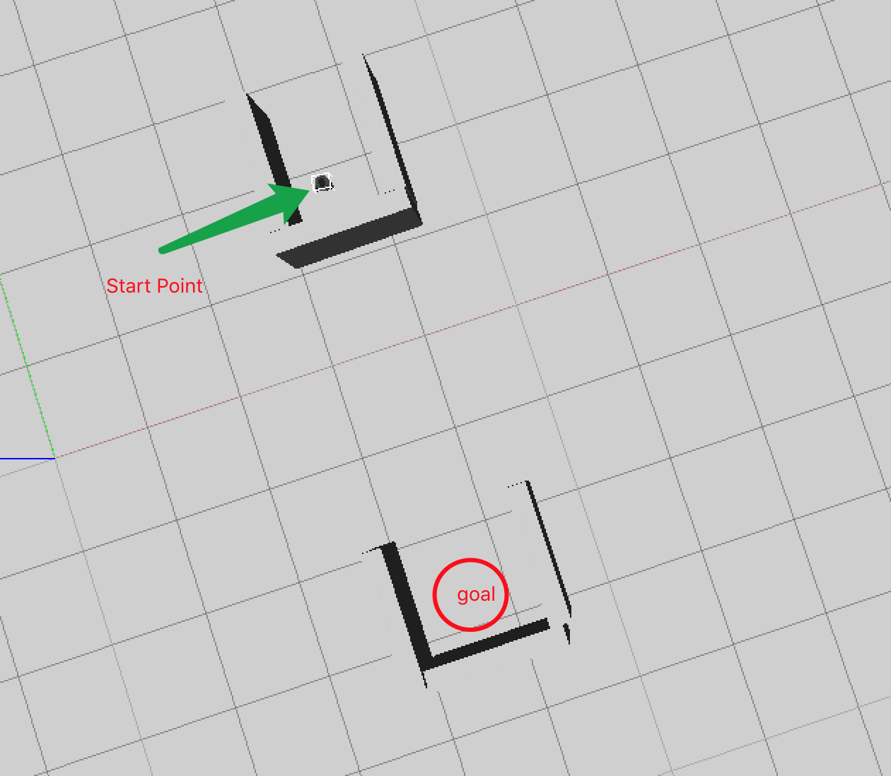
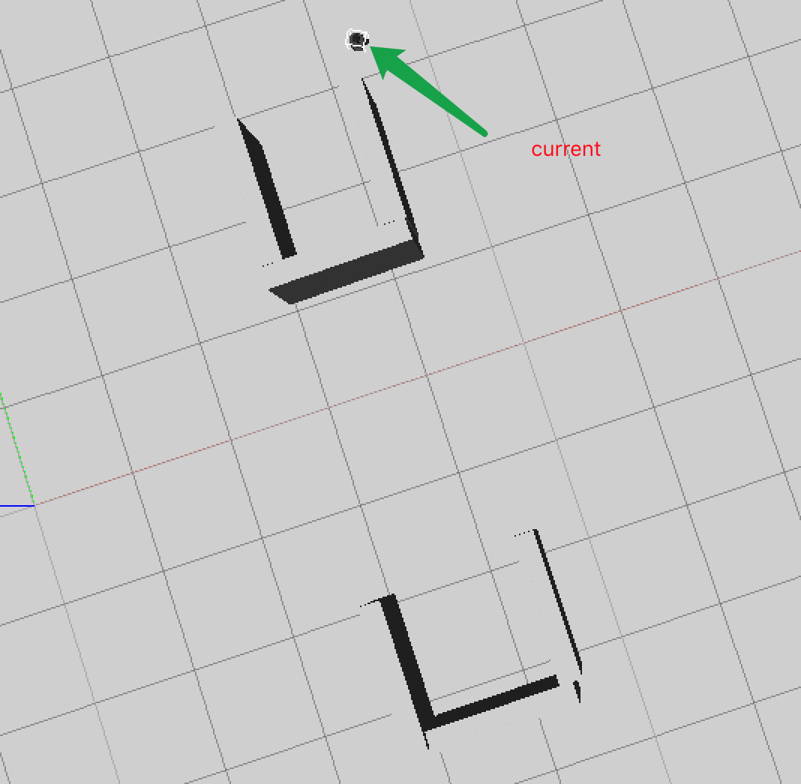
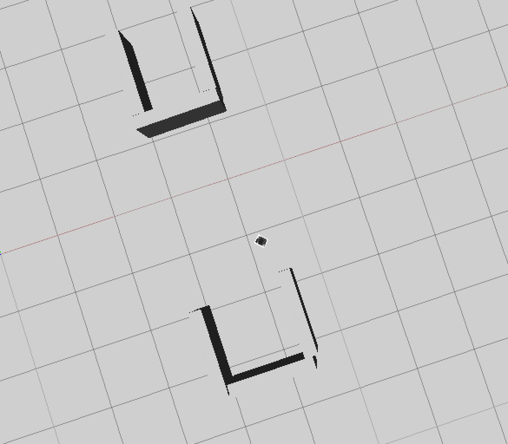
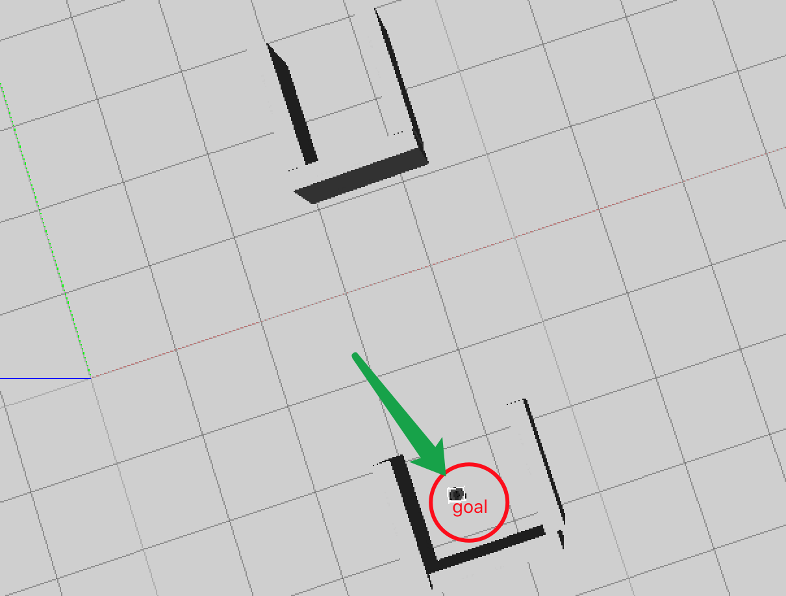

# CS401 Assignment 4

**Name**: 徐逸飞（Yifei Xu） 

**SID**: 11611209


#### Following the MATLAB & TurtleBot3 Gazebo Simulator connection and communication tutorial and implement your HW01 reactive paradigm algorithms in TurtleBot3 Simulator to show how your turtlebot achieving the goal and avoid or escape from local minima.


**Design**

The path is fixed and then it is sent to the turtlebot. By collecting the feedback information from the robot, a new velocity and an anguler velocity are determined. Consequently, the new values are able to drive the robot in a appropriate path. The local minima will be avoided by feedback and resetting.


**Codes**

```matlab
clear all;
close all;
rosshutdown;

SELF_IP = '172.16.162.128';
ROS_MASTER_URI = 'http://172.16.162.128:11311';
ROS_IP = '10.21.84.93';

setenv('ROS_MASTER_URI', ROS_MASTER_URI);
setenv('ROS_IP',ROS_IP);
rosinit(SELF_IP,'NodeHost',ROS_IP);
linkStates = rossubscriber('/gazebo/link_states');
stateData = receive(linkStates);
velPub = rospublisher('/cmd_vel');
velMsg = rosmessage(velPub);

tftree = rostf;
pause(1);

path = [3.6 1.8;5 4.5;5 -1;4 -1;3.5 -2.5];
controller = robotics.PurePursuit('Waypoints',path);
controller.DesiredLinearVelocity=0.4;
controlRate=robotics.Rate(10);
goalRadius = 0.1;
robotCurrentLocation=path(1,:);
robotGoal=path(end,:);
distanceToGoal = norm(robotCurrentLocation-robotGoal);

while(distanceToGoal > goalRadius)
    
    pose = getTransform(tftree, 'odom', 'base_footprint', 'Timeout', 2);
    position = [pose.Transform.Translation.X,pose.Transform.Translation.Y];
    orientation = quat2eul([pose.Transform.Rotation.W, pose.Transform.Rotation.X, ...
        pose.Transform.Rotation.Y,pose.Transform.Rotation.Z],'ZYX');
    robotPose = [position,orientation(1)];[v, w] = controller(robotPose);
    velMsg.Linear.X=v;
    velMsg.Angular.Z=w;
    send(velPub,velMsg);
    
    distanceToGoal = norm(robotPose(1:2)-robotGoal);
    waitfor(controlRate);
end
velMsg.Linear.X=0;
velMsg.Angular.Z=0;
send(velPub,velMsg);

```


**Image**

1. The initial state.

   

2. Then

   

3. Near the goal state

   

4. At last

   